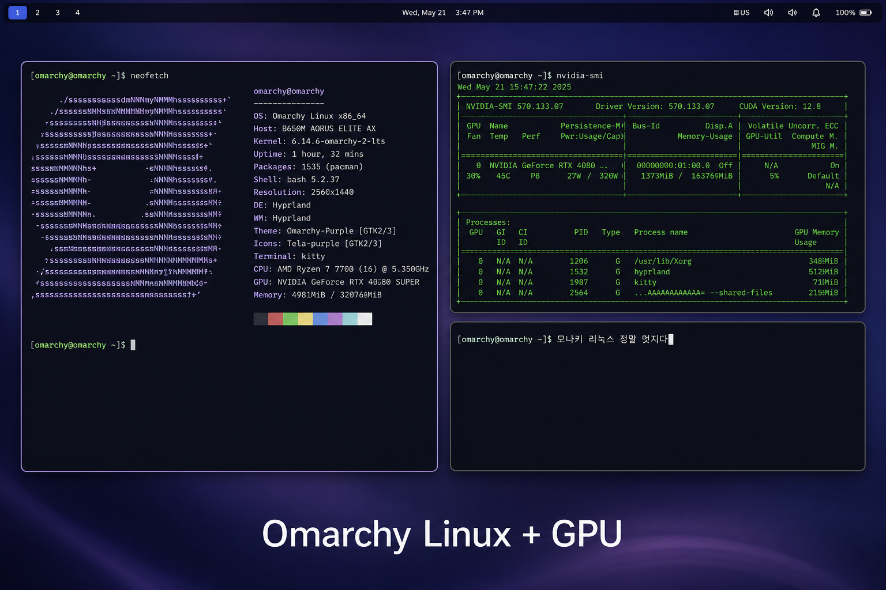
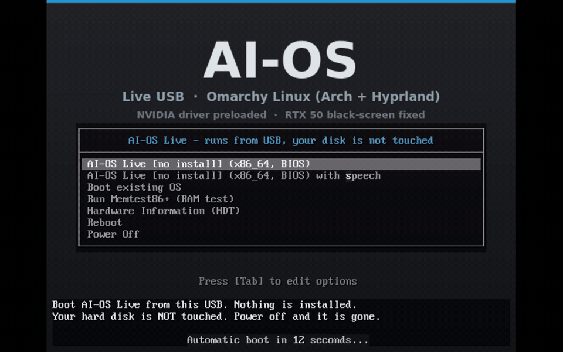

# AI-OS — GPU 가 그냥 잡히는 Omarchy 라이브 USB



### 부팅부터 데스크톱까지 — 실제 화면입니다



USB 로 부팅 → OMARCHY 로그인 → 한글 데스크톱. 실기 화면이고, 기다리는 구간만 빨리 감았습니다.

**[Omarchy Linux](https://omarchy.org) 를 그대로 쓰되, GPU 와 한글만 손봤습니다.**

Omarchy 는 DHH(Ruby on Rails 만든 사람)가 만든 Arch Linux + Hyprland 배포판입니다.
좋은 물건인데, **NVIDIA GPU 가 꽂힌 기계에서 라이브로 띄우면 두 가지가 막힙니다** —
RTX 50 시리즈에서 화면이 검게 나오고, 한글을 칠 수 없습니다.

이 저장소는 그 둘을 고친 **라이브 ISO 빌드 스크립트**입니다.
설치하지 않습니다. USB 로 부팅해서 쓰고, 전원을 끄면 흔적이 남지 않습니다.

| | |
|---|---|
| **베이스** | Omarchy Linux (Arch + Hyprland) — 데스크톱·앱·설정은 그대로입니다 |
| **우리가 더한 것** | GPU 자동 인식 · 한글 입력 · 부팅 메뉴 · 영구 저장 · 그 밖의 라이브 수리 |
| **바꾸지 않은 것** | Omarchy 의 화면·키맵·테마·기본 앱. 상류가 갱신되면 그대로 따라갑니다 |

> Omarchy 를 처음 보신다면 [omarchy.org](https://omarchy.org) 를 먼저 보십시오.
> 이 저장소는 그 위에 얹는 얇은 층이지, 별개의 배포판이 아닙니다.

---

## 왜 만들었나

GPU 가 달린 컴퓨터 앞에 앉을 때마다 환경 만드느라 시간을 버리는 것이 싫어서입니다.

Omarchy 자체는 훌륭합니다. 다만 그것은 **설치해서 쓰는 데스크톱**을 상정하고 만들어져,
"USB 하나 들고 가서 아무 컴퓨터에나 꽂는다" 는 쓰임새에서는 몇 가지가 걸립니다.

RTX 5070 이 꽂혀 있는 컴퓨터라도, 리눅스 라이브로 부팅하면 **화면이 검게 나옵니다.**
겨우 부팅해도 드라이버를 컴파일하느라 몇십 분을 기다립니다.
빌린 시간이라면 그동안에도 요금은 계속 나갑니다.

그래서 **꽂으면 바로 되는 것**을 만들었습니다.

---

## 1. GPU 자동 인식 — 이것이 핵심입니다

### RTX 50 시리즈 검은 화면을 고쳤습니다

RTX 5060 · 5070 에서 리눅스 라이브를 부팅하면 **화면이 검게 나오고 아무것도 안 보입니다.**
NVIDIA 의 새 커널 모듈(`nvidia_drm`)이 이 세대 카드에서 화면 출력을 가로채기 때문입니다.

AI-OS 는 부팅할 때 그 모듈만 막습니다.

```
modprobe.blacklist=nvidia_drm
```

**그런데 연산은 그대로 삽니다.** `nvidia`·`nvidia_uvm` 은 그대로 올라가므로
`nvidia-smi` 도 CUDA 도 정상입니다. 화면을 살리려고 GPU 를 죽이지 않았습니다.

> 처음에는 `nvidia_drm.modeset=0` 을 시도했는데, 그러면 Wayland 가 안 뜹니다.
> 모듈 자체를 빼는 것이 정답이었습니다.

### 드라이버를 미리 컴파일해 넣었습니다

보통 라이브 ISO 는 부팅한 뒤에 커널 모듈을 빌드합니다. 화면에
`Building module...` 이 뜨고 몇십 분이 지나갑니다.

AI-OS 는 **ISO 를 만들 때 DKMS 로 미리 빌드해 넣습니다.**
부팅하면 모듈이 이미 있으니 바로 뜹니다.

- `nvidia-open-dkms` — 최신 세대(Turing 이후)
- `nvidia-580xx` — 구형 카드
- `cuda` — 연산 라이브러리 포함

### 분할 GPU(vGPU)도 거부하지 않습니다

클라우드에서 빌리는 GPU 는 물리 카드를 쪼갠 것일 때가 많습니다.
NVIDIA open 커널모듈은 기본적으로 그것을 거부합니다. AI-OS 는 그 검사를 풀어
**H100 같은 데이터센터 카드도 그대로 잡습니다.** 물리 카드에는 아무 영향이 없습니다.

### 확인하는 법

부팅한 뒤 터미널에서:

```
nvidia-smi
```

카드 이름·메모리·드라이버 판번이 나오면 끝입니다. 아무것도 안 해도 됩니다.

---

## 2. 한글이 됩니다

원래 Omarchy 에는 **한글 폰트 자체가 없습니다.** 한글이 두부 네모(□□□)로 나오고,
입력기도 없어 칠 수도 없습니다.

AI-OS 는 **D2Coding** 폰트를 넣어 글자가 보이게 하고, `fcitx5-hangul` 로 칠 수 있게 했습니다.
D2Coding 은 고정폭이라 터미널에서 한글과 영문이 어긋나지 않습니다.

데스크톱이 뜰 때 입력기가 자동으로 켜지고, 한/영 전환은 평소 쓰던 대로 됩니다.

> 이게 생각보다 까다로웠습니다. omarchy 가 소유한 설정 파일을 고쳐야 하는데,
> ISO 에 미리 얹으면 패키지 설치 때 충돌이 납니다. 그래서 **설치가 끝난 뒤에
> 손대는 훅**으로 넣었습니다.

---

## 3. 그 밖에 고친 것들

전부 실제로 겪은 문제입니다.

| 무엇 | 원래 | AI-OS |
|---|---|---|
| **부팅 메뉴** | 안 보임(`timeout=0`) | **10초 표시.** 메뉴가 안 뜨면 커널 파라미터를 넣을 방법이 없습니다 |
| **Wi-Fi** | 명령줄로만 | NetworkManager 탑재. 클릭으로 잡습니다 |
| **이름 해석(DNS)** | 안 될 때가 있음 | 8.8.8.8 · 1.1.1.1 폴백 |
| **시계** | UTC | 한국 시간(KST) |
| **첫 부팅 팝업** | 매번 뜸 | 차단. 그중 "Update System" 은 라이브에서 누르면 오류가 납니다 |
| **SSH** | 없음 | 켜져 있습니다. 화면 사진 대신 원격으로 진단할 수 있습니다 |
| **sudo** | 거의 없음 | 부팅 후 고칠 수 있게 열었습니다 |
| **데스크톱** | 콘솔로 부팅 | 그래픽으로 바로 |
| **쓰기 공간** | 256MB | **8GB** + 영구 저장 모드 |

---

## 4. 저장한 것이 남게 하려면 — 영구 저장 모드

라이브 USB 는 읽기 전용이라, 쓰기가 전부 RAM 으로 갑니다.
**재부팅하면 사라집니다.** 업데이트를 해도 남지 않습니다.

USB 에 저장 영역을 하나 준비하면 그것을 쓰기 계층으로 씁니다.
업데이트도 설정도 만든 파일도 남고, 용량은 RAM 이 아니라 **USB 크기만큼**입니다.

1. USB 안에 라벨이 `AIOSDATA` 인 ext4 저장 영역을 만듭니다
2. 부팅 메뉴에서 **"영구 저장(USB 에 남긴다)"** 항목을 고릅니다

Ventoy 를 쓰면 설치할 때 "보존 공간"을 20GB 쯤 잡고 그 자리에 만들면 됩니다.
자세한 것은 [docs/persist.md](docs/persist.md).

---

## 5. USB 에 굽는 법

### Ventoy (권장 — 가장 쉽습니다)

Ventoy 를 USB 에 설치하면, 그 뒤로는 **ISO 파일을 그냥 복사**하면 됩니다.
여러 개를 넣어두고 부팅할 때 골라 쓸 수 있습니다.

동봉한 스크립트를 쓰면 한 번에 됩니다:

```
./tools/make-usb.sh /dev/sdX aios.iso     # Linux
tools\make-usb.ps1 -Disk 2 -Iso aios.iso  # Windows
```

### 직접 굽기

`dd` 나 Rufus 로 구워도 됩니다. 다만 영구 저장을 쓰려면 Ventoy 쪽이 편합니다.

---

## 6. 내려받기

ISO 가 커서 GitHub 릴리스에 **2GB 씩 나눠** 올렸습니다.
전부 받은 뒤 합치면 됩니다.

```
# Linux / macOS
cat aios-public-*.iso.part* > aios.iso
sha256sum -c aios-public-*.iso.sha256
```

```powershell
# Windows (PowerShell) — 릴리스 페이지의 조각을 전부 받은 폴더에서
cmd /c "copy /b aios-public-20260904c.iso.part00+aios-public-20260904c.iso.part01+aios-public-20260904c.iso.part02+aios-public-20260904c.iso.part03 aios.iso"
Get-FileHash aios.iso -Algorithm SHA256
```

합친 뒤 반드시 **체크섬을 확인**하세요. 한 조각이라도 덜 받으면 부팅이 안 됩니다.

---

## 7. 부팅한 뒤 데스크톱이 허전하면

라이브 세션에서는 터미널 맨 위에 이런 오류가 뜨고, 배경화면과 상단 바가 안 나올 수 있습니다.

```
error: foot: ~/.config/foot/foot.ini:2: [main].include:
  ~/.local/state/omarchy/current/theme/foot.ini: failed to open
```

원인은 하나입니다. Omarchy 는 테마를 `~/.local/state/omarchy/current/` 에 두는데
그 디렉토리는 **설치 과정에서** `omarchy-theme-set` 이 만듭니다.
라이브 세션은 설치를 거치지 않으므로 없습니다.

보정 스크립트를 한 번 실행하면 됩니다.

```bash
curl -O https://raw.githubusercontent.com/Hostingglobal-Tech/omarchy-gpu-live/main/patches/aios-live-fix.sh
chmod +x aios-live-fix.sh
./aios-live-fix.sh
```

테마·배경화면·상단 바가 서고, 150초 뒤 화면을 덮는 화면보호기도 함께 끕니다.
무엇을 하는지는 [patches/aios-live-fix.sh](patches/aios-live-fix.sh) 에 전부 적혀 있습니다.

## 8. 자주 묻는 것

**Q. 설치하는 건가요?**
아니요. USB 로 부팅해서 씁니다. 하드디스크를 건드리지 않습니다.
전원을 끄면 아무것도 남지 않습니다(영구 저장 모드를 쓰지 않는 한).

**Q. 제 컴퓨터에 있는 파일이 지워지나요?**
아니요. 읽지도 쓰지도 않습니다.

**Q. RTX 4090 / 3080 도 되나요?**
됩니다. `nvidia-open-dkms` 는 Turing(RTX 20) 이후를 지원하고,
구형 카드용 `nvidia-580xx` 도 함께 들어 있습니다.

**Q. AMD GPU 는요?**
커널 기본 드라이버(amdgpu)로 화면은 나옵니다. 다만 이 ISO 는 NVIDIA 를 겨냥해
만들었습니다. ROCm 같은 연산 스택은 안 들어 있습니다.

**Q. 인터넷이 꼭 필요한가요?**
부팅과 사용에는 필요 없습니다. 패키지를 새로 받으려면 필요합니다.
(오프라인 설치용 미러는 크기 때문에 뺐습니다)

**Q. "디스크 용량이 부족하다"고 나옵니다.**
라이브의 쓰기 공간(RAM)이 찬 것입니다. 8GB 로 늘려 두었지만 OS 전체 업데이트에는
모자랍니다. **영구 저장 모드**를 쓰시면 USB 크기만큼 쓸 수 있습니다(위 4번).

**Q. 화면이 검게 나옵니다.**
부팅 메뉴에서 기본 항목을 고르셨는지 확인하세요. 그 항목에 이미 수리가 들어 있습니다.
그래도 안 되면 메뉴에서 `e` 를 눌러 `nomodeset` 을 추가해 보세요.

**Q. 한/영 전환이 안 됩니다.**
데스크톱이 완전히 뜬 뒤 잠깐 기다려 보세요. 입력기가 자동으로 켜집니다.
그래도 안 되면 터미널에서 `fcitx5 &` 를 실행하세요.

**Q. 부팅 메뉴가 너무 빨리 지나갑니다.**
10초로 늘려 두었습니다. 그래도 놓치면 전원을 껐다 켜고 화살표 키를 눌러 두세요.

**Q. Ventoy 에서 부팅이 안 됩니다.**
Ventoy 설정에서 "Secure Boot 지원"을 켜 보세요.
그래도 안 되면 BIOS 에서 Secure Boot 를 끄셔야 합니다.

**Q. GPU 를 여러 장 꽂았는데 하나만 잡힙니다.**
`nvidia-smi -L` 로 목록을 확인하세요. 전부 나오는데 하나만 쓰인다면
그건 애플리케이션 설정 문제입니다.

**Q. 상업적으로 써도 되나요?**
Omarchy 와 Arch Linux 의 라이선스를 따릅니다. NVIDIA 드라이버는 NVIDIA 라이선스입니다.
빌드 스크립트 자체는 MIT 입니다.

---

## 9. 직접 빌드하기

```
git clone <이 저장소>
cd AI-OS
make overlay        # 우리 수정을 상류 ISO 트리에 얹는다
make check          # 얹힌 것이 실제로 들어갔는지 확인 (28항목)
cd ../omarchy-iso && AIOS_NO_OFFLINE_MIRROR=1 ./bin/omarchy-iso-make
```

`make check` 가 하나라도 실패하면 빌드하지 마세요.
**얹었다고 믿지 말고 확인하는 것**이 이 프로젝트의 원칙입니다.

빌드에는 **50GB 이상의 여유 공간**과 약 1시간 30분이 걸립니다.

---

## 라이선스

빌드 스크립트: MIT
포함된 소프트웨어: 각자의 라이선스(Arch Linux, Omarchy, NVIDIA)를 따릅니다.
